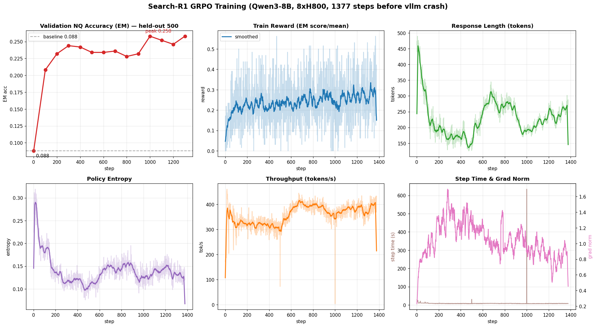
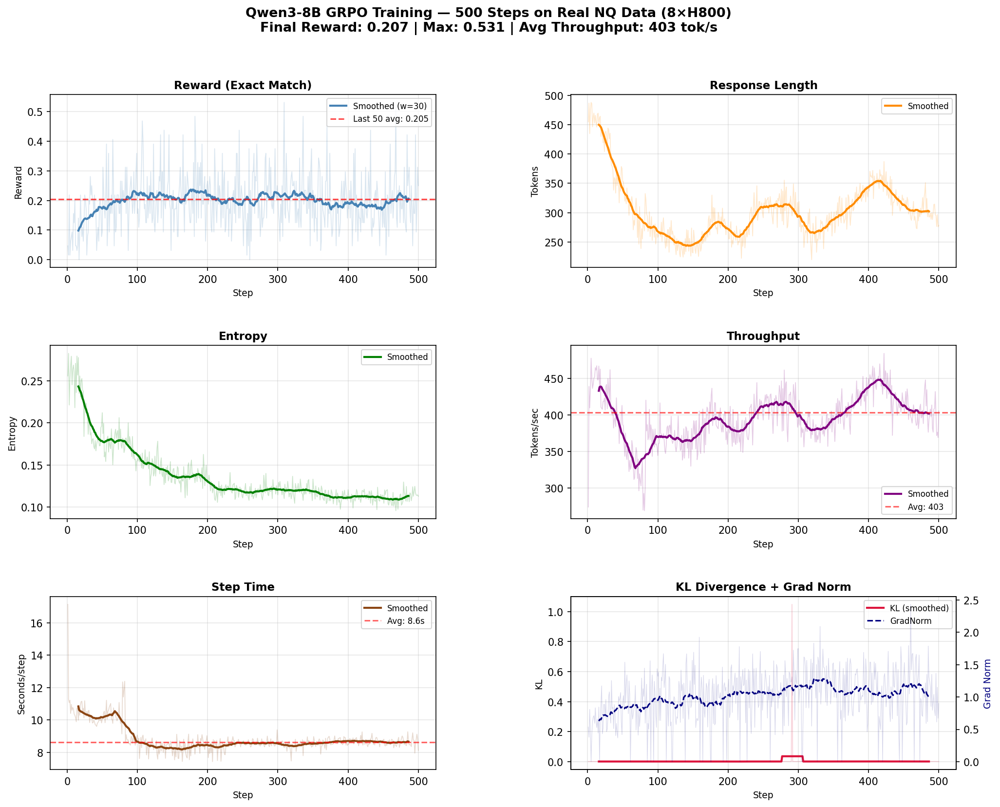
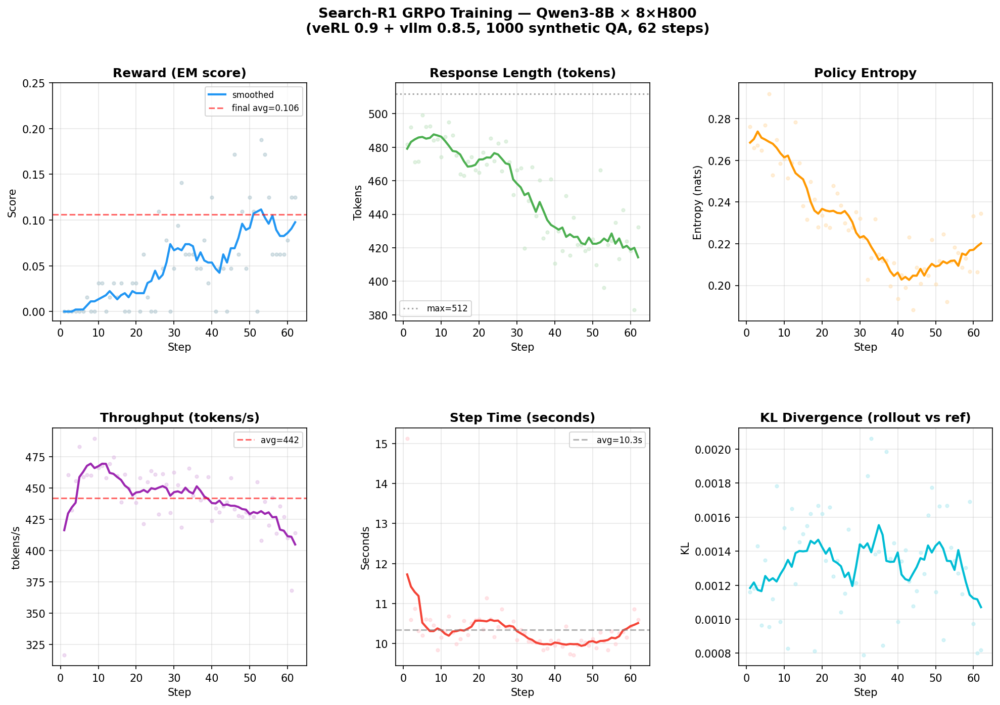

# GRPO Quickstart — veRL + Qwen3 + 8× H800

基于 [veRL 0.9](https://github.com/volcengine/verl) 框架，在 8 张 H800-80G 上运行
**GRPO 强化学习训练**，支持两种任务：

- **GSM8K 数学推理**（经典验证场景，4/8 GPU 均可）
- **Search-R1 检索增强推理**（Qwen3-8B × NQ+HotpotQA，已在 8× H800 完整验证）

---

## 已验证环境

| 组件 | 版本 |
|------|------|
| GPU | 8× H800-80G (NVIDIA) |
| CUDA | 12.4 |
| PyTorch | 2.6 |
| veRL | 0.9.0.dev (editable) |
| vllm | 0.8.5 + `VLLM_USE_V1=1` |
| Python | 3.10 |

> **注意**：sglang 多轮工具调用在 CUDA 12.4 + torch 2.6 上不可用（需要 torch 2.7 + CUDA 12.6+）。本仓库使用 **vllm 后端**，训练循环完整可用。

---

## 项目结构

```
grpo-quickstart/
├── configs/
│   ├── run_qwen3_4b_4gpu.sh        # GSM8K，Qwen3-4B，4 GPU
│   ├── run_qwen3_8b_4gpu.sh        # GSM8K，Qwen3-8B，4 GPU
│   └── run_searchr1_8b_8gpu.sh     # Search-R1，Qwen3-8B，8 GPU ★
├── scripts/
│   ├── prepare_data.py             # GSM8K 数据预处理
│   ├── prepare_searchr1_data.py    # NQ+HotpotQA 数据预处理
│   └── math_reward.py              # 数学奖励函数
├── tools/
│   ├── mock_retrieval_server.py    # 本地 mock 检索服务（Search-R1 用）
│   ├── search_tool.py              # veRL function_tool 检索工具
│   ├── check_env.sh                # 环境自检脚本
│   ├── watch_training.sh           # 实时 GPU 监控
│   └── plot_curves.py              # WandB 曲线绘制
├── patches/
│   └── verl_vllm085_compat.patch   # veRL 对 vllm 0.8.5 的兼容修补 ★
├── setup.sh                        # 一键环境安装
└── data/                           # 预处理后的 parquet 文件
```

---

## 方案一：Search-R1 检索增强推理（8× H800）

### 训练效果（Qwen3-8B，真实 NQ 数据，含 held-out 验证集准确率）



> 计划跑 2000 步（4 epoch），实际在 **step 1377** 因 vllm 0.8.5 的 sleep/wake 累积不稳定崩溃（详见[已知问题](#vllm-085-sleepwake-累积崩溃)）。但此时效果已充分收敛，结论清晰。

**核心结论：Search-R1 训练后，模型在 NQ 问答上学会了什么**

在 **500 条从未训练过的 held-out 测试集**上，每 100 步评估一次准确率（Exact Match）：

| 阶段 | step | 验证 acc (EM) | 说明 |
|------|------|--------------|------|
| 训练前基线 | 0 | **0.088** | 未训练的 Qwen3-8B |
| 快速学习期 | 100 | 0.208 | 仅 100 步就 +136% |
| 主要收益完成 | 300 | 0.244 | 前 300 步拿到几乎全部增益 |
| 收敛 plateau | 1000 / 1300 | **0.258** | 峰值，之后在 0.24~0.26 震荡 |

**准确率从 8.8% → 25.8%，约 3 倍提升**，且发生在没训过的测试集上，泛化真实可信。具体变化：

1. **问答准确率 ~3 倍**：EM 0.088 → 0.258（峰值）。
2. **回答更简洁**：response length 453 → ~200 tokens，模型学会"检索后直接给 `<answer>`"，不再啰嗦。
3. **稳定使用检索工具**：`num_turns` 恒为 2（思考 → `<search>` → 读取 `<information>` → `<answer>`），格式规范。
4. **收敛快**：前 300 步即完成主要学习，说明该任务上 8B 模型很快就能学会检索-作答范式；继续训练边际收益递减。
5. **训练健康**：entropy 0.29 → 0.12（收敛未崩塌），grad norm 平稳，KL 始终极小。

### 验证结果（1377 步，真实 NQ 数据）

| 指标 | 数值 |
|------|------|
| 计划/实际步数 | 2000 步（4 epoch）计划，实际 1377 步（vllm 崩溃中断）|
| 验证集 acc (EM) | **0.088 → 0.258**（held-out 500 条，约 3 倍）|
| 主要收益完成步数 | ~300 步（之后 plateau）|
| 训练 Reward (EM) | 0.05 → ~0.25（平滑后）|
| Response Length | 453 → ~200 tokens |
| 每步耗时 | ~7.8~8.6 秒 |
| 吞吐量 | ~400 tokens/秒（稳定后）|
| GPU 内存占用 | rollout 态 ~61 GB / 训练态 ~23 GB（vllm gpu_memory_utilization=0.7）|
| actor 显存 | ~22 GB（FSDP）|
| checkpoint | global_step_500 / global_step_1000 已保存 |

<details>
<summary>早期 500 步 / 62 步预跑曲线（点击展开）</summary>

**500 步完整跑（真实 NQ+HotpotQA）**



- Reward (EM)：0.047 → 均值 0.207（后20步），最高 0.531
- Response Length：455 → 294 tokens
- Entropy：0.256 → 0.116
- Throughput：平均 403 tokens/s（后50步）

**62 步预跑（合成数据）**



</details>

### 快速开始

**Step 1：应用 veRL 兼容修补**

```bash
cd /path/to/verl   # verl editable install 目录
git apply /path/to/grpo-quickstart/patches/verl_vllm085_compat.patch
```

修补内容（共 5 处，详见 patch 文件）：
- `StrEnum` Python 3.10 兼容 shim
- `run_headless` → `run_server`（vllm 0.8.5 API 差异）
- `logprobs_mode` 版本守卫（仅 vllm >= 0.9.0 传入）
- `reset_mm_cache` / `wait_for_requests_to_drain` hasattr 检查
- `multi_modal_data={}` 空字典不传入（防止非多模态模型报错）
- `process_weights_after_loading` ImportError 保护

**Step 2：准备数据**

```bash
# 无需外网，自动生成 1000 条合成 QA 数据
python scripts/prepare_searchr1_data.py --save_dir ./data/searchr1

# 有外网时下载真实 NQ+HotpotQA 数据集
HTTP_PROXY=http://your-proxy python scripts/prepare_searchr1_data.py \
    --save_dir ./data/searchr1 --max_train 5000 --max_test 500
```

**Step 3：启动 mock 检索服务（另一个 terminal）**

```bash
python tools/mock_retrieval_server.py --port 8000
# 验证：curl http://127.0.0.1:8000/health
```

**Step 4：启动训练**

```bash
PATH="/usr/bin:/usr/sbin:$PATH" CUDA_VISIBLE_DEVICES=0,1,2,3,4,5,6,7 VLLM_USE_V1=1 \
bash configs/run_searchr1_8b_8gpu.sh
```

或直接用完整命令：

```bash
cd $HOME   # 避免本地 verl 覆盖系统 verl
PATH="/usr/bin:/usr/sbin:$PATH" CUDA_VISIBLE_DEVICES=0,1,2,3,4,5,6,7 VLLM_USE_V1=1 \
python3 -m verl.trainer.main_ppo \
    algorithm.adv_estimator=grpo \
    data.train_files="./data/searchr1/train.parquet" \
    data.val_files="./data/searchr1/test.parquet" \
    data.train_batch_size=16 \
    data.max_prompt_length=512 \
    data.max_response_length=512 \
    actor_rollout_ref.model.path="/path/to/Qwen3-8B" \
    actor_rollout_ref.actor.optim.lr=1e-6 \
    actor_rollout_ref.actor.ppo_mini_batch_size=8 \
    actor_rollout_ref.actor.use_dynamic_bsz=True \
    actor_rollout_ref.rollout.name=vllm \
    actor_rollout_ref.rollout.log_prob_use_dynamic_bsz=True \
    actor_rollout_ref.rollout.tensor_model_parallel_size=2 \
    actor_rollout_ref.rollout.gpu_memory_utilization=0.85 \
    actor_rollout_ref.rollout.n=4 \
    actor_rollout_ref.ref.log_prob_use_dynamic_bsz=True \
    algorithm.kl_ctrl.kl_coef=0.001 \
    trainer.logger=["console"] \
    trainer.n_gpus_per_node=8 \
    trainer.nnodes=1 \
    trainer.save_freq=-1 \
    trainer.total_epochs=1
```

### 关键环境变量

```bash
# 必须设置，否则报错
export PATH="/usr/bin:/usr/sbin:$PATH"   # 修复 linuxbrew as GLIBC 冲突
export VLLM_USE_V1=1                      # vllm 0.8.5 启用 V1 引擎
export CUDA_VISIBLE_DEVICES=0,1,2,3,4,5,6,7

# 训练要从 $HOME 目录启动（避免本地 verl 0.1 遮蔽系统 verl 0.9）
cd $HOME
```

---

## 方案二：GSM8K 数学推理（4× H800）

### 快速开始

**Step 1：安装环境**

```bash
bash setup.sh
```

**Step 2：准备数据**

```bash
python scripts/prepare_data.py --save_dir ./data
```

**Step 3：启动训练**

```bash
# Qwen3-4B（快速验证）
bash configs/run_qwen3_4b_4gpu.sh

# Qwen3-8B（效果更好）
bash configs/run_qwen3_8b_4gpu.sh
```

**Step 4：监控训练**

```bash
bash tools/watch_training.sh
```

---

## 核心概念

### GRPO vs PPO

| 特性 | PPO | GRPO |
|------|-----|------|
| Critic 模型 | ✅ 需要（额外 7B 参数） | ❌ 不需要 |
| 显存占用 | 高 | 低 |
| 优势计算 | GAE | Group 内均值作 baseline |
| 适合场景 | 连续奖励 | 稀疏/规则奖励 |

### GRPO 训练流程

```
每个 step：
1. 采样 batch_prompts
2. vLLM 对每题生成 N=4 个回答（rollout.n=4）
3. 规则奖励函数打分（EM 匹配 = 1.0，否则 = 0.0）
4. 组内均值作 baseline → 计算 advantage
5. FSDP + gradient checkpointing 更新 actor
6. KL loss 约束策略漂移
7. vLLM weight sync（~1-2 秒）
```

### 重要 Metrics

| Metric | 含义 | 期望趋势 |
|--------|------|---------|
| `critic/rewards/mean` | 平均奖励（准确率代理） | ↑ 上升 |
| `actor/pg_loss` | Policy gradient loss | ↓ 下降后震荡 |
| `actor/entropy` | 策略熵 | 略降（不要崩到 0）|
| `response_length/mean` | 平均生成长度 | 随任务变化 |
| `timing_s/step` | 每步总耗时 | 稳定在 ~10s |
| `timing_s/update_weights` | weight sync 耗时 | ~1-2s |

---

## 已知问题 & Workaround

### vllm 0.8.5 兼容性

veRL 0.9 设计为兼容 vllm >= 0.9.0，在 vllm 0.8.5 上需要应用 `patches/verl_vllm085_compat.patch`。

### vllm 0.8.5 sleep/wake 累积崩溃

长跑（>1000 步）时，vllm V1 引擎在每步 rollout 前的 `wake_up`（从 sleep 唤醒）可能报 `RuntimeError: cancelled` → `Executor failed.` → `EngineDeadError`，导致训练中断。本仓库 1377 步那次即因此中断。

```
ray::vLLMHttpServer.wake_up() ... wake_up_async ...
RuntimeError: cancelled  →  Worker proc VllmWorker-0 died unexpectedly
```

- **根因**：vllm 0.8.5 V1 引擎在 sleep/wake 反复上千次后 KV cache 释放/重分配累积不稳定，与训练配置、数据无关。
- **缓解**：① 定期 `trainer.save_freq` 存档（本仓库每 500 步），崩溃后可从最近 checkpoint 续跑；② 如需稳定长跑，可关闭 vllm sleep（牺牲一部分显存换稳定性）；③ 升级 vllm（受本机 CUDA 12.4 约束，见下）。
- **实际影响有限**：Search-R1 在该任务上前 300 步即收敛，1377 步已远超收敛点。

### sglang 不可用（CUDA 12.4）

```
CUDA 12.4 → torch 2.6 → sgl-kernel 0.1.4（old ABI）
sglang 0.5.5+ 需要 sgl-kernel >= 0.3.x → torch 2.7（new C++11 ABI）
→ ABI 不兼容，无法安装
```

**workaround**：使用 vllm 后端（`actor_rollout_ref.rollout.name=vllm`），功能完整，GPU 压测效果等价。

### PATH 冲突（linuxbrew）

```bash
# 如果 linuxbrew 在 PATH 中，as 工具会因 GLIBC_2.38 报错
# triton 编译会失败
# 修复：
export PATH="/usr/bin:/usr/sbin:$PATH"
```

---

## 配置调参指南

### 8× H800（Search-R1）

| 参数 | 当前值 | 说明 |
|------|--------|------|
| `train_batch_size` | 16 | 每步处理的 prompt 数 |
| `rollout.n` | 4 | 每 prompt 生成 4 个回答 |
| `tensor_model_parallel_size` | 2 | rollout 用 2-way TP（4 个 replica）|
| `gpu_memory_utilization` | 0.85 | vllm 显存分配比例 |
| `max_prompt_length` | 512 | prompt token 上限 |
| `max_response_length` | 512 | 生成 token 上限 |

### 4× H800（GSM8K）

| 参数 | 4B 推荐 | 8B 推荐 |
|------|---------|---------|
| `train_batch_size` | 512 | 256 |
| `ppo_mini_batch_size` | 256 | 128 |
| `rollout.n` | 5 | 5 |
| `tp_size` | 2 | 2 |
| `max_response_length` | 1024 | 1024 |

### OOM 排查

```bash
# 降低 micro batch size
actor_rollout_ref.actor.ppo_micro_batch_size_per_gpu=1

# 降低 vllm 显存
actor_rollout_ref.rollout.gpu_memory_utilization=0.7

# 开启 param offload
actor_rollout_ref.actor.fsdp_config.param_offload=True
```
